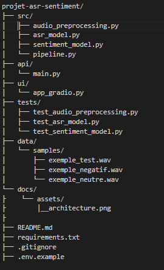

Projet ASR + Analyse de sentiment
Pipeline complet transformant un fichier audio en français en une analyse de sentiment (positif / négatif / neutre), en combinant reconnaissance vocale (ASR) et traitement du langage naturel (NLP).


## Sommaire

- [Architecture](#architecture)
- [Modèles utilisés](#modèles-utilisés)
- [Installation](#installation)
- [Utilisation](#utilisation)
- [Démonstration sur 3 fichiers de test](#démonstration-sur-3-fichiers-de-test)
- [Tests](#tests)
- [Limites connues](#limites-connues)
- [Structure du projet](#structure-du-projet)

---

## Architecture

Le pipeline suit 4 étapes séquentielles, implémentées chacune dans un module dédié
(`src/`), orchestrées par `src/pipeline.py` :

1. **Prétraitement audio** (`audio_preprocessing.py`) : chargement du fichier,
   conversion en mono, rééchantillonnage à 16 kHz, normalisation de l'amplitude
   (zero-mean, unit-variance), et validation (fichier vide, silencieux, ou trop long).
2. **Transcription** (`asr_model.py`) : le signal prétraité est transcrit en texte via
   un modèle Wav2Vec 2.0 fine-tuné pour le français.
3. **Analyse de sentiment** (`sentiment_model.py`) : le texte transcrit est classifié
   en positif / négatif / neutre via un modèle CamemBERT, avec un score de confiance
   associé (softmax).
4. **Interfaces** : le même pipeline (`run_pipeline()`) est exposé de deux façons
   indépendantes — une API REST (`api/main.py`, FastAPI) et une interface web
   (`ui/app_gradio.py`, Gradio).

Ce découplage permet de tester, maintenir et faire évoluer chaque brique
indépendamment (voir `tests/`).

---

## Modèles utilisés

| Tâche | Modèle | Lien Hugging Face |
|---|---|---|
| ASR (Speech-to-Text) | Wav2Vec 2.0 XLSR-53, fine-tuné français | [jonatasgrosman/wav2vec2-large-xlsr-53-french](https://huggingface.co/jonatasgrosman/wav2vec2-large-xlsr-53-french) |
| Analyse de sentiment | DistilCamemBERT fine-tuné sentiment | [cmarkea/distilcamembert-base-sentiment](https://huggingface.co/cmarkea/distilcamembert-base-sentiment) |

**Justification des choix :**

- **Wav2Vec 2.0 (XLSR-53 français)** : ce modèle est spécifiquement fine-tuné sur des
  corpus de parole française, ce qui donne de bien meilleurs résultats qu'un modèle
  anglais générique. Il repose sur un pré-entraînement auto-supervisé massif (XLSR-53,
  53 langues), ce qui lui permet une bonne robustesse même avec un fine-tuning léger
  sur le français.
- **DistilCamemBERT (sentiment)** : CamemBERT est l'équivalent français de BERT/RoBERTa,
  entraîné sur un large corpus francophone (OSCAR). La version *Distil* (compressée)
  a été choisie pour son bon compromis performance/vitesse d'inférence. Ce modèle a été
  fine-tuné sur des avis clients notés de 1 à 5 étoiles ; un mapping est appliqué pour
  ramener ces 5 classes aux 3 classes attendues (1-2 étoiles → négatif, 3 → neutre,
  4-5 → positif).

---

## Installation

**Prérequis :** Python ≥ 3.9, [ffmpeg](https://ffmpeg.org/download.html) installé et
accessible dans le PATH (nécessaire pour décoder les fichiers `.mp3`).

```bash
# 1. Cloner le dépôt
git clone https://github.com/FatoubDieng/projet-asr-sentiment.git
cd projet-asr-sentiment

# 2. Créer et activer un environnement virtuel
python -m venv venv
source venv/bin/activate        # macOS / Linux
venv\Scripts\activate           # Windows (PowerShell)

# 3. Installer les dépendances
pip install -r requirements.txt
```

> **Note (Windows uniquement)** : si vous rencontrez une erreur liée à `hf_xet` lors
> du premier téléchargement des modèles depuis Hugging Face, désactivez ce mécanisme
> de transfert avant de relancer :
> ```powershell
> $env:HF_HUB_DISABLE_XET = "1"
> ```

Au premier lancement, les modèles (~1,5 Go au total) sont automatiquement téléchargés
depuis Hugging Face et mis en cache localement (`~/.cache/huggingface/`) ; les
exécutions suivantes sont beaucoup plus rapides.

---

## Utilisation

### Interface Gradio

```bash
python -m ui.app_gradio
```

Ouvre une interface web sur `http://127.0.0.1:7860`, permettant d'uploader ou
d'enregistrer un fichier audio, et affichant la transcription intermédiaire, le
sentiment détecté, et le score de confiance.

### API REST

```bash
uvicorn api.main:app --reload
```

L'API est disponible sur `http://127.0.0.1:8000`, avec une documentation interactive
auto-générée sur `http://127.0.0.1:8000/docs`.

**Endpoint principal :** `POST /predict`

**Exemple d'appel avec curl :**
```bash
curl -X POST "http://127.0.0.1:8000/predict" \
  -F "file=@data/samples/exemple_negatif.wav"
```

**Exemple d'appel avec Python :**
```python
import requests

with open("data/samples/exemple_negatif.wav", "rb") as f:
    response = requests.post(
        "http://127.0.0.1:8000/predict",
        files={"file": f}
    )

print(response.json())
```

**Réponse type :**
```json
{
  "transcription": "cette expérience était vraiment décevante...",
  "sentiment": "négatif",
  "confidence": 0.891
}
```

### Via Docker

Le projet peut aussi être lancé entièrement conteneurisé, sans dépendre de
l'environnement Python local :

```bash
docker build -t projet-asr-sentiment .
docker run -p 8000:8000 projet-asr-sentiment
```

L'API est alors accessible de la même façon sur `http://127.0.0.1:8000/docs`.

---

## Démonstration sur 3 fichiers de test

Trois fichiers audio de démonstration, un par classe de sentiment, sont fournis dans
`data/samples/` :

| Fichier | Phrase | Sentiment attendu |
|---|---|---|
| `exemple_test.wav` | "Ce restaurant était vraiment excellent..." | positif |
| `exemple_negatif.wav` | "Cette expérience était vraiment décevante..." | négatif |
| `exemple_neutre.wav` | "Le colis est arrivé mardi à quatorze heures..." | neutre |

Pour reproduire la démonstration :
```bash
curl -X POST "http://127.0.0.1:8000/predict" -F "file=@data/samples/exemple_test.wav"
curl -X POST "http://127.0.0.1:8000/predict" -F "file=@data/samples/exemple_negatif.wav"
curl -X POST "http://127.0.0.1:8000/predict" -F "file=@data/samples/exemple_neutre.wav"
```

---

## Tests

```bash
pytest tests/ -v
```

La suite de tests couvre :
- le prétraitement audio (fichier valide, fichier manquant, normalisation) ;
- la transcription ASR (type de retour, non-vacuité) ;
- l'analyse de sentiment (textes positifs/négatifs, texte vide, structure du résultat).

---

## Limites connues

- **Risque théorique d'erreurs en cascade** : comme le pipeline enchaîne deux modèles
  (ASR puis sentiment), une transcription imparfaite pourrait en théorie faire basculer
  la classification de sentiment finale. Dans la pratique, l'évaluation quantitative
  menée (voir section "Évaluation quantitative" ci-dessous) montre que, sur le jeu de
  test utilisé, le pipeline est resté robuste : malgré un WER moyen de 18.8 % sur l'ASR,
  la classification de sentiment est restée correcte à 100 % sur les 3 échantillons.
  Ce risque reste néanmoins à surveiller sur un jeu de données plus large.
- **Mapping 5->3 classes** : le modèle de sentiment a été entraîné sur une échelle de 1
  à 5 étoiles (avis clients), puis ramené aux 3 classes attendues (1-2 étoiles ->
  négatif, 3 -> neutre, 4-5 -> positif). Ce mapping reste une approximation.
- **Synthèse vocale vs voix humaine** : les tests réalisés avec des voix de synthèse
  (Text-to-Speech) peuvent présenter des taux d'erreur de transcription différents
  d'une voix humaine naturelle.
- **Durée maximale** : les fichiers de plus de 5 minutes sont automatiquement rejetés,
  conformément à la limite fixée dans le cahier des charges.
- **Langue** : le pipeline est optimisé exclusivement pour le français.
- **Performance sur Hugging Face Spaces** : la démo publique tourne sur le hardware
  gratuit **ZeroGPU** (GPU partagé, alloué dynamiquement par requête) — les temps de
  réponse peuvent varier selon la disponibilité du cluster partagé.
- **Versions de dépendances non figées** : pour éviter des conflits de résolution
  rencontrés entre `gradio`, `huggingface_hub` et l'infrastructure ZeroGPU, le fichier
  `requirements.txt` liste les bibliothèques sans version figée. Cette approche
  sacrifie une partie de la reproductibilité stricte, mais s'est avérée nécessaire
  pour garantir la compatibilité entre les environnements local, Docker et Hugging
  Face Spaces.

## Évaluation quantitative

Un script evaluate.py calcule deux métriques standards sur le petit jeu de données annoté (les 3 fichiers de data/samples/, avec leur texte de référence exact et leur sentiment attendu) :

bash
python evaluate.py

Résultats obtenus :

Fichier                   |     WER | Attendu    | Prédit    
-----------------------------------------------------------------
exemple_test.wav          |  25.0% | positif    | positif   
exemple_negative.wav      |  19.0% | négatif    | négatif   
exemple_neutre.wav        |  12.5% | neutre     | neutre 

WER moyen (ASR) : 18.8 %
Accuracy (sentiment) : 100 %
F1-score macro (sentiment) : 100 %

**Interprétation et limites de cette évaluation :** le WER confirme que le modèle ASR
commet des erreurs de transcription réelles et non négligeables. Sur cet échantillon
précis, ces erreurs n'ont pas suffi à faire basculer la classification de sentiment
finale, d'où un score parfait de 100 %. **Ce résultat doit être interprété avec
prudence** : avec seulement 3 échantillons (un par classe), le F1-score n'est pas
statistiquement représentatif de la performance réelle du pipeline sur des cas plus
variés.

## Structure du projet


