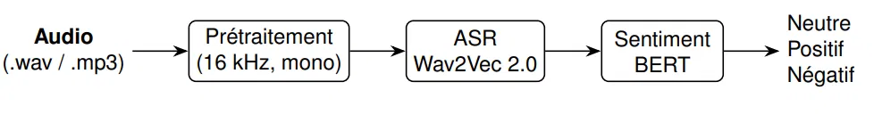

# Projet DL: detection Automatique de sentiment(positif / négatif / neutre) dans des appels vocaux 
# a l'aide Wav2Vec 2.0 (ASR) et BERT (NLP)



## Sommaire

Sommaire
Architecture
Modèles utilisés
Installation
Utilisation
Démonstration sur 3 fichiers de test
Tests
Limites connues
Structure du projet

---

## Architecture

Le pipeline suit 4 étapes séquentielles, implémentées chacune dans un module dédié
(`src/`), orchestrées par `src/pipeline.py` :

1. **Prétraitement audio** (`audio_preprocessing.py`) : chargement du fichier,
   conversion en mono, rééchantillonnage à 16 kHz, normalisation de l'amplitude
   (zero-mean, unit-variance), et validation (fichier vide, silencieux, ou trop long).
2. **Transcription** (`asr_model.py`) : le signal prétraité est transcrit en texte via
   un modèle Wav2Vec 2.0 fine-tuné pour le français.
3. **Analyse de sentiment** (`sentiment_model.py`) : le texte transcrit est classifié
   en positif / négatif / neutre via un modèle CamemBERT, avec un score de confiance
   associé (softmax).
4. **Interfaces** : le même pipeline (`run_pipeline()`) est exposé de deux façons
   indépendantes — une API REST (`api/main.py`, FastAPI) et une interface web
   (`ui/app_gradio.py`, Gradio).

Ce découplage permet de tester, maintenir et faire évoluer chaque brique
indépendamment (voir `tests/`).

---

## Modèles utilisés

| Tâche                | Modèle                                  | Lien Hugging Face                                                                                                   |
| ASR (Speech-to-Text) | Wav2Vec 2.0 XLSR-53, fine-tuné français | [jonatasgrosman/wav2vec2-large-xlsr-53-french](https://huggingface.co/jonatasgrosman/wav2vec2-large-xlsr-53-french) |
| Analyse de sentiment | DistilCamemBERT fine-tuné sentiment     | [cmarkea/distilcamembert-base-sentiment](https://huggingface.co/cmarkea/distilcamembert-base-sentiment)             |

**Justification des choix :**

- **Wav2Vec 2.0 (XLSR-53 français)** : ce modèle est spécifiquement fine-tuné sur des
  corpus de parole française. Il repose sur un pré-entraînement auto-supervisé massif (XLSR-53,
  53 langues), ce qui lui permet une bonne robustesse même avec un fine-tuning léger
  sur le français.

- **DistilCamemBERT (sentiment)** : CamemBERT est l'équivalent français de BERT/RoBERTa,
  entraîné sur un large corpus francophone (OSCAR). La version *Distil* (compressée)
  a été choisie pour son bon compromis performance/vitesse d'inférence, adapté à un
  usage en API avec des contraintes de latence. Ce modèle a été fine-tuné sur des avis
  clients notés de 1 à 5 étoiles ; un mapping est appliqué pour ramener ces 5 classes
  aux 3 classes attendues (1-2 étoiles → négatif, 3 → neutre, 4-5 → positif).


## Installation

**Prérequis :** Python ≥ 3.9, [ffmpeg](https://ffmpeg.org/download.html) installé et
accessible dans le PATH (nécessaire pour décoder les fichiers `.mp3`).

bash
# 1. Cloner le dépôt
git clone 
cd projet-asr-sentiment

# 2. Créer et activer un environnement virtuel
python -m venv venv
source venv/bin/activate        # macOS / Linux
venv\Scripts\activate           # Windows (PowerShell)

# 3. Installer les dépendances
pip install -r requirements.txt

> **Note (Windows uniquement)** : si vous rencontrez une erreur liée à `hf_xet` lors
> du premier téléchargement des modèles depuis Hugging Face, désactivez ce mécanisme
> de transfert avant de relancer :
> ```powershell
> $env:HF_HUB_DISABLE_XET = "1"
> ```

Au premier lancement, les modèles (~1,5 Go au total) sont automatiquement téléchargés
depuis Hugging Face et mis en cache localement (`~/.cache/huggingface/`) ; les
exécutions suivantes sont beaucoup plus rapides.

## Utilisation

### Interface Gradio

bash
python -m ui.app_gradio

Ouvre une interface web sur `http://127.0.0.1:7860`, permettant d'uploader ou
d'enregistrer un fichier audio, et affichant la transcription intermédiaire, le
sentiment détecté, et le score de confiance.

### API REST

bash
uvicorn api.main:app --reload


L'API est disponible sur `http://127.0.0.1:8000`, avec une documentation interactive
auto-générée sur `http://127.0.0.1:8000/docs`.

**Endpoint principal :** `POST /predict`

**Exemple d'appel avec curl :**

bash
curl -X POST "http://127.0.0.1:8000/predict" \
  -F "file=@data/samples/exemple_negatif.wav"


**Exemple d'appel avec Python :**
python
import requests

with open("data/samples/exemple_negatif.wav", "rb") as f:
    response = requests.post(
        "http://127.0.0.1:8000/predict",
        files={"file": f}
    )

print(response.json())


**Réponse type :**
```json
{
  "transcription": "cette expérience était vraiment décevante...",
  "sentiment": "négatif",
  "confidence": 0.891
}
```


## Démonstration sur 3 fichiers de test

Trois fichiers audio de démonstration, un par classe de sentiment, sont fournis dans
`data/samples/` :


 `exemple_test.wav`   : "Ce restaurant était vraiment excellent..."       positif 
 `exemple_negatif.wav`: "Cette expérience était vraiment décevante..."    négatif 
 `exemple_neutre.wav` : "Le colis est arrivé mardi à quatorze heures..."  neutre 

Pour reproduire la démonstration :
bash
curl -X POST "http://127.0.0.1:8000/predict" -F "file=@data/samples/exemple_test.wav"
curl -X POST "http://127.0.0.1:8000/predict" -F "file=@data/samples/exemple_negatif.wav"
curl -X POST "http://127.0.0.1:8000/predict" -F "file=@data/samples/exemple_neutre.wav"
```

## Tests

bash
pytest tests/ -v

La suite de tests couvre :
- le prétraitement audio (fichier valide, fichier manquant, normalisation) ;
- la transcription ASR (type de retour, non-vacuité) ;
- l'analyse de sentiment (textes positifs/négatifs, texte vide, structure du résultat).

---

## Limites connues

- **Erreurs en cascade** : une transcription ASR imparfaite 
  Exemple observé : le mot "décevante" mal transcrit en
  "disvante". 
- **Mapping 5→3 classes** : le modèle de sentiment est entraîné sur une échelle de 1 à
  5 étoiles ; le mapping vers 3 classes (négatif/neutre/positif) est une approximation,
  notamment la classe "3 étoiles → neutre" qui peut recouvrir des nuances variées.
- **Durée maximale** : les fichiers de plus de 5 minutes sont rejetés (limite fixée)
- **Langue** : le pipeline est optimisé pour le français ; son usage sur d'autres
  langues n'est pas supporté par les modèles choisis.

## Structure du projet

projet-asr-sentiment/
├── src/
│   ├── audio_preprocessing.py
│   ├── asr_model.py
│   ├── sentiment_model.py
│   └── pipeline.py
├── api/
│   └── main.py
├── ui/
│   └── app_gradio.py
├── tests/
│   ├── test_audio_preprocessing.py
│   ├── test_asr_model.py
│   └── test_sentiment_model.py
├── data/
│   └── samples/
│       ├── exemple_test.wav
│       ├── exemple_negatif.wav
│       └── exemple_neutre.wav
└── docs/
├    └── assets/
├        │__architecture.png
├
├── README.md
├── requirements.txt
├── .gitignore
├── .env.example